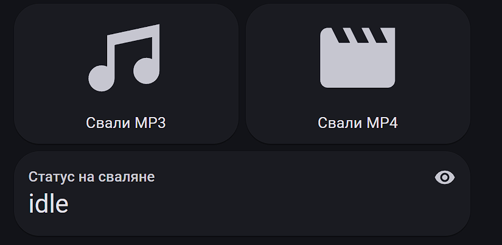

# YT-DLP Downloader - Home Assistant Integration

Това е персонализирана интеграция за Home Assistant, която ви позволява да сваляте аудио или видео файлове от YouTube и други поддържани сайтове чрез `yt-dlp`.

## Основни Функции

*   **Сваляне на Видео/Аудио**: Поддържа сваляне в MP4 и MP3 формат.
*   **Поддръжка на Плейлисти**: Можете да поставите URL на цял плейлист.
*   **Сензор за Статус**: Показва прогреса на сваляне в реално време (`Downloading (Video 3 of 15)`).
*   **Предотвратяване на Дубликати**: Интеграцията помни свалените файлове и ги пропуска, ако се опитате да ги свалите отново.
*   **Интеграция с Jellyfin/Kodi**: Автоматично създава `.nfo` файлове с метаданни, които медийни сървъри могат да използват.
*   **SponsorBlock**: Автоматично премахва спонсорирани сегменти, интро и други от видеата.


## 2. Инсталация през HACS

1.  В Home Assistant отидете в `HACS` > `Integrations`.
2.  Изберете `Custom repositories` от менюто.
3.  Поставете URL адреса на вашето GitHub хранилище, изберете категория `Integration` и натиснете `Add`.
4.  Намерете новата интеграция в списъка и натиснете `Install`.

## 3. Конфигурация

Добавете следния код във вашия `configuration.yaml` файл:

```yaml
# configuration.yaml

yt_dlp_downloader:
  # Задължително: Пътят, където ще се запазват файловете.
  download_path: /media/videos

  # --- Опционални настройки ---

  # Ниво на логване. Може да бъде 'info' или 'debug' за повече детайли.
  log_level: info

  # Ако е 'true', ще се създават .nfo файлове, съвместими с Jellyfin/Kodi.
  write_nfo_files: true

  # Ако е 'true', интеграцията ще помни свалените файлове и ще ги пропуска.
  prevent_duplicates: true

  # Списък с категории на SponsorBlock за автоматично премахване.
  # Възможни стойности: sponsor, intro, outro, selfpromo, interaction, music_offtopic
  sponsorblock_remove:
    - sponsor
    - selfpromo
```

След като добавите конфигурацията, **рестартирайте Home Assistant**.

## 4. Lovelace Карта
За да добавите карта в Lovelace, която позволява въвеждане на YouTube URL и сваляне на видео/аудио, следвайте тези стъпки:


**1. Създайте `input_text` помощник:**
*   Отидете в `Settings` > `Devices & Services` > `Helpers`.
*   Натиснете `Create Helper` и изберете `Text`.
*   Дайте му име, например `YouTube URL Input` (това ще създаде `input_text.youtube_url_input`).

**2. Добавете картата в Lovelace:**

```yaml
type: vertical-stack
cards:
  - type: entities
    entities:
      - entity: input_text.youtube_url_input
        name: YouTube/Playlist URL
  - type: horizontal-stack
    cards:
      - type: button
        name: Свали MP3
        icon: mdi:music
        tap_action:
          action: call-service
          service: yt_dlp_downloader.download
          service_data:
            url: "{{ states('input_text.youtube_url_input') }}"
            format: mp3
      - type: button
        name: Свали MP4
        icon: mdi:movie
        tap_action:
          action: call-service
          service: yt_dlp_downloader.download
          service_data:
            url: "{{ states('input_text.youtube_url_input') }}"
            format: mp4
  - type: entity
    entity: sensor.yt_dlp_downloader_status
    name: Статус на сваляне
  - type: conditional
    conditions:
      - entity: sensor.yt_dlp_downloader_status
        state_not: "idle"
      - entity: sensor.yt_dlp_downloader_status
        state_not: "Finished"
    card:
      type: gauge
      entity: sensor.yt_dlp_downloader_status
      attribute: progress
      name: Прогрес
      unit: '%'
      severity:
        green: 75
        yellow: 50
        red: 0
```